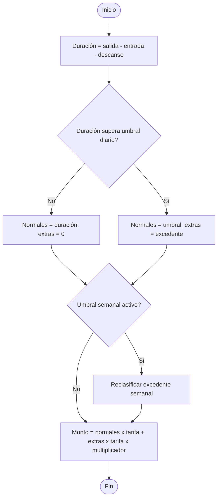

# Actividad: cálculo de extras

```mermaid
flowchart TD
  A([Inicio]) --> B[Duración = salida - entrada - descanso]
  B --> C{Duración supera umbral diario?}
  C -- No --> D[Normales = duración; extras = 0]
  C -- Sí --> E[Normales = umbral; extras = excedente]
  D --> F{Umbral semanal activo?}
  E --> F
  F -- Sí --> G[Reclasificar excedente semanal]
  F -- No --> H[Monto = normales x tarifa + extras x tarifa x multiplicador]
  G --> H --> I([Fin])
```
