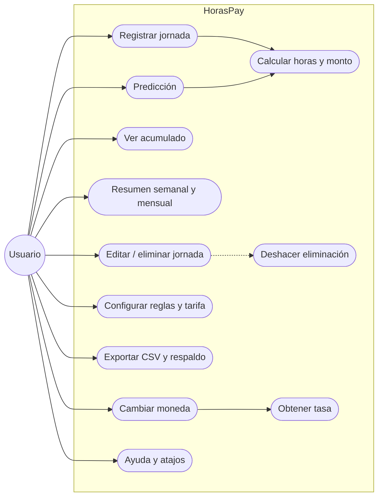

# Casos de uso

```mermaid
flowchart LR
  U((Usuario))
  subgraph HorasPay
    UC1([Registrar jornada]) --> UC9([Calcular horas y monto])
    UC2([Editar / eliminar jornada]) -.-> UC2b([Deshacer eliminación])
    UC3([Ver acumulado])
    UC4([Resumen semanal y mensual])
    UC5([Predicción]) --> UC9
    UC6([Configurar reglas y tarifa])
    UC7([Exportar CSV y respaldo])
    UC8([Cambiar moneda]) --> UC10([Obtener tasa])
    UC11([Ayuda y atajos])
  end
  U --> UC1 & UC2 & UC3 & UC4 & UC5 & UC6 & UC7 & UC8 & UC11
```
