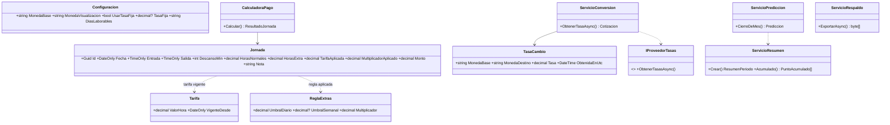

# Clases de dominio y servicios

```mermaid
classDiagram
  class Jornada { +Guid Id +DateOnly Fecha +TimeOnly Entrada +TimeOnly Salida +int DescansoMin +decimal HorasNormales +decimal HorasExtra +decimal TarifaAplicada +decimal MultiplicadorAplicado +decimal Monto +string Nota }
  class Tarifa { +decimal ValorHora +DateOnly VigenteDesde }
  class ReglaExtras { +decimal UmbralDiario +decimal? UmbralSemanal +decimal Multiplicador }
  class Configuracion { +string MonedaBase +string MonedaVisualizacion +bool UsarTasaFija +decimal? TasaFija +string DiasLaborables }
  class TasaCambio { +string MonedaBase +string MonedaDestino +decimal Tasa +DateTime ObtenidaEnUtc }
  class CalculadoraPago { +Calcular() ResultadoJornada }
  class ServicioConversion { +ObtenerTasaAsync() Cotizacion }
  class ServicioResumen { +Crear() ResumenPeriodo +Acumulado() PuntoAcumulado[] }
  class ServicioPrediccion { +CierreDeMes() Prediccion }
  class ServicioRespaldo { +ExportarAsync() byte[] }
  class IProveedorTasas { <<interface>> +ObtenerTasasAsync() }
  Jornada ..> Tarifa : tarifa vigente
  Jornada ..> ReglaExtras : regla aplicada
  CalculadoraPago --> Jornada
  ServicioConversion --> TasaCambio
  ServicioConversion ..> IProveedorTasas
  ServicioPrediccion ..> ServicioResumen
```
