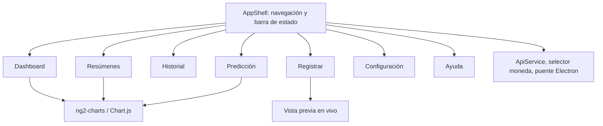

# Componentes frontend

```mermaid
flowchart TD
  Shell[AppShell: navegación y barra de estado] --> Dash[Dashboard]
  Shell --> Reg[Registrar]
  Shell --> Hist[Historial]
  Shell --> Res[Resúmenes]
  Shell --> Pre[Predicción]
  Shell --> Cfg[Configuración]
  Shell --> Ayu[Ayuda]
  Dash & Res & Pre --> Charts[ng2-charts / Chart.js]
  Reg --> Vista[Vista previa en vivo]
  Shell --> Core[ApiService, selector moneda, puente Electron]
```
