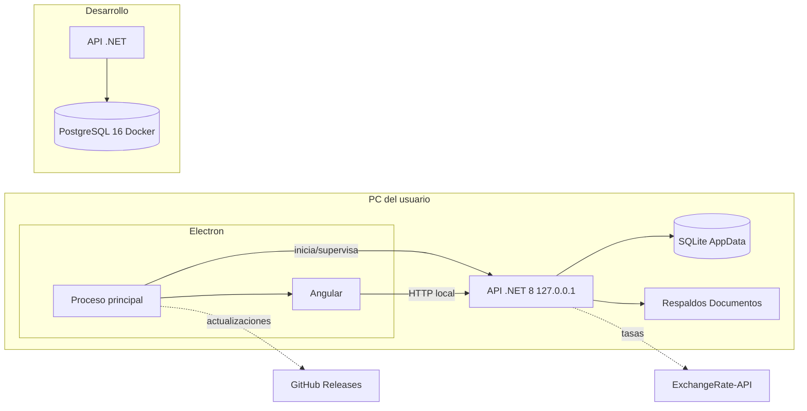

# Despliegue

```mermaid
flowchart LR
  subgraph PC_usuario[PC del usuario]
    subgraph Electron
      M[Proceso principal] --> R[Angular]
    end
    M -->|inicia/supervisa| A[API .NET 8 127.0.0.1]
    R -->|HTTP local| A
    A --> S[(SQLite AppData)]
    A --> B[Respaldos Documentos]
  end
  subgraph Desarrollo
    A2[API .NET] --> P[(PostgreSQL 16 Docker)]
  end
  A -. tasas .-> T[ExchangeRate-API]
  M -. actualizaciones .-> G[GitHub Releases]
```
