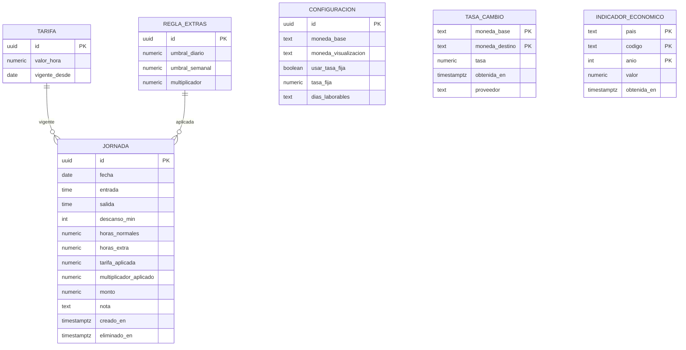

# Modelo entidad-relación

```mermaid
erDiagram
  JORNADA { uuid id PK date fecha time entrada time salida int descanso_min numeric horas_normales numeric horas_extra numeric tarifa_aplicada numeric multiplicador_aplicado numeric monto text nota timestamptz creado_en timestamptz eliminado_en }
  TARIFA { uuid id PK numeric valor_hora date vigente_desde }
  REGLA_EXTRAS { uuid id PK numeric umbral_diario numeric umbral_semanal numeric multiplicador }
  CONFIGURACION { uuid id PK text moneda_base text moneda_visualizacion boolean usar_tasa_fija numeric tasa_fija text dias_laborables }
  TASA_CAMBIO { text moneda_base PK text moneda_destino PK numeric tasa timestamptz obtenida_en text proveedor }
  INDICADOR_ECONOMICO { text pais PK text codigo PK int anio PK numeric valor timestamptz obtenida_en }
  TARIFA ||--o{ JORNADA : vigente
  REGLA_EXTRAS ||--o{ JORNADA : aplicada
```

Índices: `JORNADA(fecha)` y `TARIFA(vigente_desde)`. `eliminado_en` implementa el borrado lógico.
