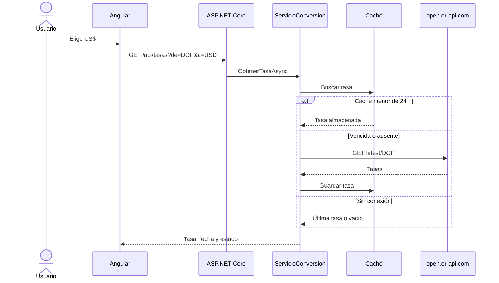

# Secuencia: cambiar moneda

```mermaid
sequenceDiagram
  actor U as Usuario
  participant UI as Angular
  participant API as ASP.NET Core
  participant S as ServicioConversion
  participant DB as Caché
  participant E as open.er-api.com
  U->>UI: Elige US$
  UI->>API: GET /api/tasas?de=DOP&a=USD
  API->>S: ObtenerTasaAsync
  S->>DB: Buscar tasa
  alt Caché menor de 24 h
    DB-->>S: Tasa almacenada
  else Vencida o ausente
    S->>E: GET latest/DOP
    E-->>S: Tasas
    S->>DB: Guardar tasa
  else Sin conexión
    DB-->>S: Última tasa o vacío
  end
  S-->>UI: Tasa, fecha y estado
```
