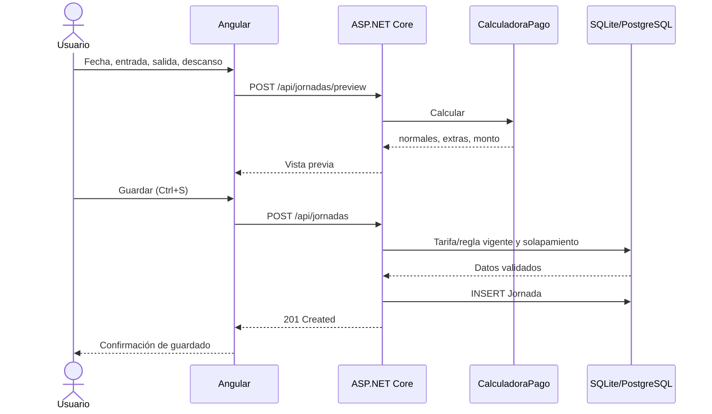

# Secuencia: registrar jornada

```mermaid
sequenceDiagram
  actor U as Usuario
  participant UI as Angular
  participant API as ASP.NET Core
  participant C as CalculadoraPago
  participant DB as SQLite/PostgreSQL
  U->>UI: Fecha, entrada, salida, descanso
  UI->>API: POST /api/jornadas/preview
  API->>C: Calcular
  C-->>API: normales, extras, monto
  API-->>UI: Vista previa
  U->>UI: Guardar (Ctrl+S)
  UI->>API: POST /api/jornadas
  API->>DB: Tarifa/regla vigente y solapamiento
  DB-->>API: Datos validados
  API->>DB: INSERT Jornada
  API-->>UI: 201 Created
  UI-->>U: Confirmación de guardado
```
